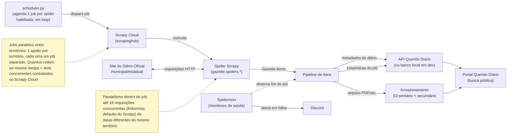

```mermaid
flowchart LR
    Scheduler["scheduler.py<br/>(agenda 1 job por spider<br/>habilitada, em loop)"] -->|dispara job| Cloud["Scrapy Cloud<br/>(scrapinghub)"]
    Cloud -->|executa| Spider["Spider Scrapy<br/>(gazette.spiders.*)"]

    NoteJobs["Jobs paralelos entre territórios: 1 spider por território, cada uma um job separado. Quantos rodam ao mesmo tempo = slots concorrentes contratados no Scrapy Cloud"]
    NoteJobs -.-> Cloud

    Site["Site do Diário Oficial<br/>municipal/estadual"] <-->|requisições HTTP| Spider

    NoteReq["Paralelismo dentro do job: até 16 requisições concorrentes (8/domínio, defaults do Scrapy) de datas diferentes do mesmo território"]
    NoteReq -.-> Spider

    Spider -->|Gazette items| Pipeline["Pipeline de Itens"]
    Pipeline -->|arquivo PDF/etc.| S3["Armazenamento<br/>S3 primário + secundário"]
    Pipeline -->|metadados do diário| API["API Querido Diário<br/>(ou banco local em dev)"]
    Pipeline -->|estatísticas do job| API

    Monitor["Spidermon<br/>(monitores de saúde)"] -.observa fim do job.-> Pipeline
    Monitor -->|alerta em falha| Discord["Discord"]

    API --> Frontend["Portal Querido Diário<br/>(busca pública)"]
    S3 --> Frontend

    classDef note fill:#fff7cc,stroke:#c9a227,stroke-width:1px,color:#333,text-align:left;
    class NoteJobs,NoteReq note;
```